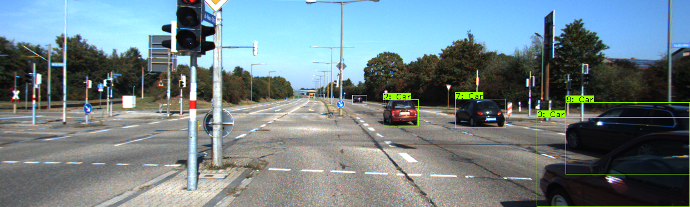
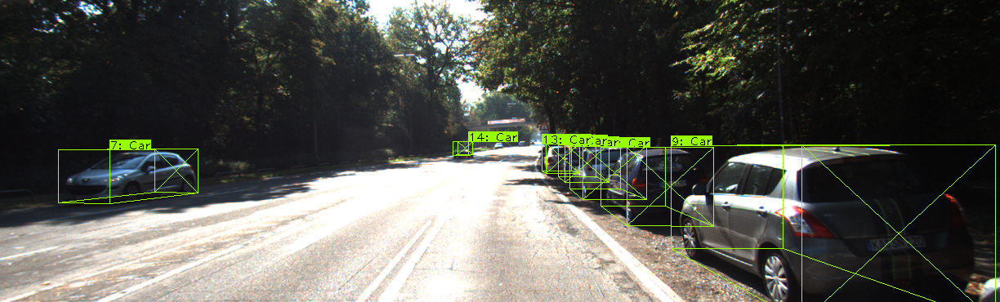
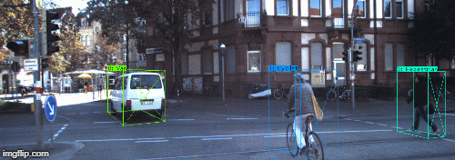
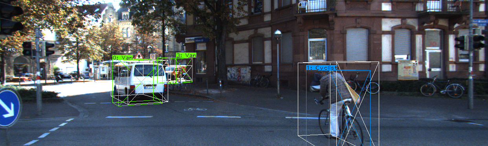

# KITTI-utils
 This repository contains utilities for loading and plotting 2D and 3D object data from the KITTI dataset. 3D bounding box coordinates are natively stored relative to the camera in 3D world-space, so these points are projected into the 2D image-space for plotting.

 Convenient Dataloader classes are provided for 2D and 3D image and track plotting. 

 Critically, when 3D bounding boxes are projected into 2D image space, depth information from these points is lost. In transform testing, a Pytorch model is trained to predict the depth of each 3D bounding box corner point, given the corner coordinates in image space. Why is this useful? Nearly all current 3D bounding box detectors and trackers use camera-space coordinates, relying on a precisely calibrated camera to generate all training and testing data. However, a convolutional neural network for 3D bounding box regression can be trained to predict coordinates natively in 2D space, and the depth estimation model can subsequently be used to reproject these coordinates back into 3D space. This allows for more flexibility in the type of data that can be used for training CNN models. 
 
 Examples below show the ground truth 3D bounding boxes in white, as well as the reprojected 2D->3D->2D bounding boxes in color, where the 2D->3D step is loss and relies on the depth estimation model.

A few additional files are included in this repository and are briefly summarized below:
- checkpoints/ - stores checkpoints for the depth estimation neural network
- images_for_readme/ -self explanatory
- label_dataset/ - contains individual labels in 2D and 3D coordinates for model training
- mailpy and munkres - from KITTI distribution, necessary for evaluation
- KITTI_eval_simple - stripped down KITTI evaluation file for appraisal of your own tracking algorithms
- util_load - contains Dataloader class and other dataset loading utility functions
- util_tf_labels - contains utilities for transforming labelset (for 2D->3D training)
- util_tf_net - contains pytorch neural network model for depth estimation
- util_parse_3d_dataset - contains utilities for creating label dataset
- transform_testing - contains code for plotting 2D->3D transformed labels
